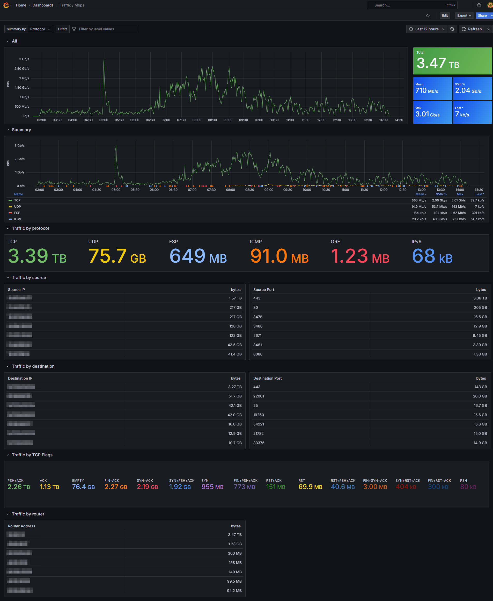

# Network Monitoring

Open source alternative to [Cloudflare Magic Network Monitoring](https://developers.cloudflare.com/magic-network-monitoring/).

## Components

- **GoFlow2**: IPFIX, NetFlow v5/v9, and sFlow collector.
- **Kafka**.
- **ClickHouse**.
- **Grafana**.

GoFlow2 sends flow data to Kafka, which is then consumed by ClickHouse for storage and analysis. Grafana is used to visualize the data.

## Grafana Dashboards

Image of Grafana dashboard showing network flow data in Mbps/MB (same dashboard is also available for PPS/Packets):

<div align="center">
  
</div>

## Setup Instructions

Clone the repository and use `docker compose` to start the services:

```bash
docker compose up -d
```

Username and password for ClickHouse: `default:password`.

Username and password for Grafana: `admin:admin`.

## Routers

Some routers do not provide `sampling_rate` in their flow data, which is required to understand what the "real" traffic is. In this case, you can enter the router's IP address and sample rate into the `flows.config` table:

```sql
INSERT INTO flows.routes (name, router_ip, default_sampling) VALUES ('my-router', '127.0.0.1', 1000);
```

## Prefixes

It is common to use prefixes to group traffic by network segments. You can add prefixes to the `flows.prefixes` table:

```sql
INSERT INTO flows.prefixes VALUES ('10.0.0.0/24');
```

We use clickhouse dictionaries to speed up prefix lookups. The dictionary is automatically populated from the `flows.prefixes` table and is updated every 5 minutes. If you want to update it manually, you can run:

```sql
SYSTEM RELOAD DICTIONARY dictionaries.prefixes;
```

For each prefix, we collect the traffic (bytes and packets) for each minute, and store it in the `flows.prefixes_total_1m` table.

_**Important Note**: The traffic is collected for the smallest prefix that matches the flow._

## Rules

We provide two types of functions to help you generate alerts based on traffic thresholds. To use these functions, you must add the prefixes in advance to the `flows.prefixes` table.

### Function definitions:

#### fireStaticBpsThresholdAlert/fireStaticPpsThresholdAlert

Alert when traffic exceeds a predefined threshold.

```
fireStaticBpsThresholdAlert(ip_prefix, threshold, duration, datetime) -> bool
fireStaticPpsThresholdAlert(ip_prefix, threshold, duration, datetime) -> bool
```

Args:

- `ip_prefix`: The IP prefix to check (e.g., '10.0.0.0/24').
- `threshold`: The threshold value in bytes per second (for BPS) or packets per second (for PPS).
- `duration`: The duration over which to check the threshold (e.g., INTERVAL 1 HOUR).
- `datetime`: The point in time to check the threshold (e.g., `now()`).

Returns:

- `true` if the threshold is exceeded, `false` otherwise.

Example Usage:

```sql
SELECT fireStaticBpsThresholdAlert('10.0.0.0/24', 100000000, INTERVAL 1 HOUR, now());
```

#### fireDynamicBpsThresholdAlert/fireDynamicPpsThresholdAlert

Alert when traffic deviates significantly from the historical average. based on z-scores.

```
fireDynamicBpsThresholdAlert(ip_prefix, sensitivity, datetime) -> bool
fireDynamicPpsThresholdAlert(ip_prefix, sensitivity, datetime) -> bool
```

Args:

- `ip_prefix`: The IP prefix to check (e.g., '10.0.0.0/24').
- `sensitivity`: The sensitivity level for the dynamic threshold. Possible values are:
  - `low`: z-score >= 4
  - `medium`: z-score >= 3
  - `high`: z-score >= 2
- `datetime`: The point in time to check the threshold (e.g., `now()`).

Returns:

- `true` if the dynamic threshold is exceeded, `false` otherwise.

Example Usage:

```sql
SELECT fireDynamicBpsThresholdAlert('10.0.0.0/24', 'medium', now());
```

### Alerting

You can use the above functions in your alerting system. For example, you can create a cron job that runs every minute to check for alerts and send notifications if any are triggered. Example script:

```bash
#!/bin/bash

# Returns 1 if the bps rate on 10.0.0.0/16 exceeds 10 Mbps in the last 2 minutes, otherwise returns 0.
QUERY_RESULT=$(clickhouse-client --password password --query "SELECT fireStaticBpsThresholdAlert('10.0.0.0/16', 10000000, INTERVAL 2 MINUTE, now())")

if [[ "$QUERY_RESULT" == "1" ]]; then
    echo "Alert: Traffic exceeded threshold!"
else
    echo "No alert triggered."
fi
```
