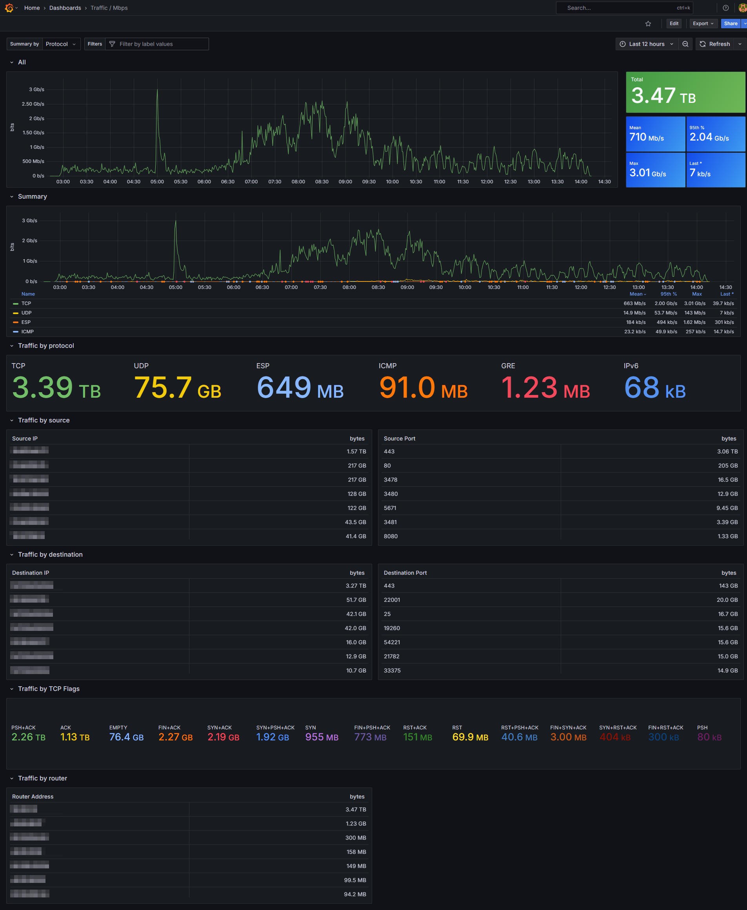

# Network Monitoring

Open source alternative to [Cloudflare Magic Network Monitoring](https://developers.cloudflare.com/magic-network-monitoring/).

## Components

- **GoFlow2**: IPFIX, NetFlow v5/v9, and sFlow collector.
- **Kafka**.
- **ClickHouse**.
- **Grafana**.

GoFlow2 sends flow data to Kafka, which is then consumed by ClickHouse for storage and analysis. Grafana is used to visualize the data.

## Grafana Dashboards

Image of Grafana dashboard showing network flow data in Mbps/MB (same dashboard is also available for PPS/Packets):

<div align="center">
  
</div>

## Setup Instructions

Clone the repository and use `docker compose` to start the services:

```bash
docker compose up -d
```

Username and password for ClickHouse: `default:password`.

Username and password for Grafana: `admin:admin`.

## ClickHouse Tables

### Configuration

| Table                  | Description                                    |
| ---------------------- | ---------------------------------------------- |
| `flows.routers`        | Router configuration (name, IP, sampling rate) |
| `flows.rules`          | Alert rules (threshold, zscore, advanced_ddos) |
| `flows.expressions`    | Custom filter expressions                      |
| `flows.prefixes_range` | IP prefix ranges for fast lookup               |

### Ingestion

| Table              | Description                               |
| ------------------ | ----------------------------------------- |
| `flows.kafka_sink` | Kafka source table for incoming flow data |
| `flows.raw`        | Raw flow data with full details           |

### Aggregation Pipeline

Traffic data flows through a feed-forward aggregation pipeline. Each level derives from the one above — only `ip_port_1m` reads from `flows.raw`.

| Table                       | Resolution | Description                                                     |
| --------------------------- | ---------- | --------------------------------------------------------------- |
| `flows.prefixes_ip_port_1m` | 1 min      | Traffic by (prefix, dst_addr, dst_port) with wide proto columns |
| `flows.prefixes_ip_port_1h` | 1 hour     | Hourly sums, bottom 5% ports filtered out                       |
| `flows.prefixes_ip_port_1d` | 1 day      | Daily p95/max, bottom 5% ports filtered out                     |
| `flows.prefixes_ip_1m`      | 1 min      | Traffic by (prefix, dst_addr) with wide proto columns           |
| `flows.prefixes_ip_1h`      | 1 hour     | Hourly sums per host                                            |
| `flows.prefixes_ip_1d`      | 1 day      | Daily p95/max per host                                          |
| `flows.prefixes_proto_1m`   | 1 min      | Traffic by (prefix) with wide proto columns                     |
| `flows.prefixes_proto_1h`   | 1 hour     | Hourly sums per prefix                                          |
| `flows.prefixes_proto_1d`   | 1 day      | Daily p95/max per prefix                                        |
| `flows.prefixes_src_1h`     | 1 hour     | Source /16 (IPv4) and /32 (IPv6) network profile per prefix     |
| `flows.prefixes_src_1d`     | 1 day      | Daily source network profile (summed from 1h)                   |

### Expression Metrics

| Table                         | Description                    |
| ----------------------------- | ------------------------------ |
| `flows.expression_metrics`    | Metrics for custom expressions |
| `flows.expression_metrics_1m` | Per-minute rollup              |

## API Reference

View the full API documentation at http://127.0.0.1:8090/docs/

## Alerting

The `alert` script is used to trigger another command whenever rules are crossed.
Add it to your crontab (or a similar scheduler) and run it every 30–60 seconds.

Example with `mail` command:

```bash
./alert | \
  mail -s "Network Alert" \
       -a "Content-Type: application/json" \
       mssp@example.com
```
